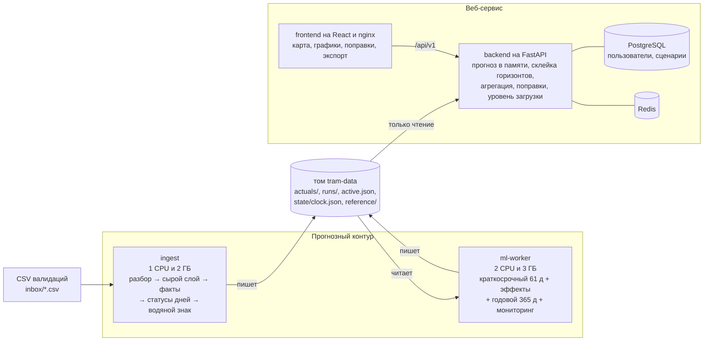

# 4. Архитектура, область определения и адаптации модели

## Схема сервисов

Готовые схемы:
- [pipeline.svg](pipeline.svg) — путь данных от CSV до экрана;
- [docker-architecture.svg](docker-architecture.svg) — контейнеры и общий том;
- [ensemble.svg](../ml-artifacts/ensemble.svg) — устройство модели.

## Модули

| слой | модуль | что делает |
|---|---|---|
| Приём и нормализация | `ml/src/mtml/ingest/` | читает CSV в DuckDB, приводит типы, отправляет битые строки в карантин, убирает дубли по `(device_no, tran_no, время)`. Считает факт маршрут на час: затронутые дни пересчитываются целиком, повторная загрузка ничего не меняет. Статусы дней `final / partial / missing` и флаг `anomaly`. Водяной знак - это последний полный день |
| Признаки и геопривязка | `ml/src/mtml/covariates.py`, `geo.py` | календарь, тип дня, каникулы, погода, события у остановок; остановки и линии маршрутов (справочник организаторов + OSM) |
| ML-прогноз | `ml/src/mtml/worker/`, `forecasters/` | краткосрочный ансамбль Chronos-2, годовая сезонная модель, контрольные прогоны для эффектов, проверки качества. Атомарная публикация: папка прогона целиком + переименование `active.json` |
| Агрегация и API | `backend/app/ml/`, `backend/app/api/v1/` | держит активный прогон в памяти и подменяет его без простоя. Склеивает факт, краткосрочный и годовой прогноз в один ряд, суммирует по часам, дням, неделям и месяцам и по группам маршрутов. Применяет поправки диспетчера к часовым строкам до агрегации и считает уровень загрузки маршрута относительно его нормы |
| Интерфейс | `frontend/` | карта Москвы с линиями и остановками, графики факт/прогноз с интервалом, карточка маршрута, поправки с превью, экспорт CSV |

**Нюансы архитектуры:**
- ML и веб связаны только через файлы на томе: HTTP между ними нет, модель меняется без правок бэкенда;
- бэкенд не хранит состояние, кроме Postgres, и подключает том только на чтение, поэтому масштабируется репликами;
- «сейчас» для всех сервисов одно — виртуальные часы `state/clock.json`. На этом работает демо: история проигрывается ускоренно, водяной знак и прогноз едут вместе с часами.

## Область определения

Где модель проверена и где ей можно верить.

| измерение | валидно | не валидно или не проверено |
|---|---|---|
| **Маршруты** | 9 маршрутов с историей: 1, 7, 11, 12, 17, 25, 26, 28, 50 | №5: посадок в данных нет, прогноз «нет данных» (`cold_start_routes`), а не ноль |
| **Детализация** | маршрут на час, любые суммы по часам, дням, неделям, месяцам и группам маршрутов | остановка или участок: в данных нет привязки валидации к остановке. Т.е. остановки на карте есть, прогноза по ним нет |
| **Горизонт** | до 61 дня работает краткосрочный ансамбль, WAPE-score 0.87–0.90 и на лидерборде 0.884 | 61–365 дней уже годовая модель, 0.79–0.85, качественная оценка. Больше года не поддерживается |
| **Период** | месяцы, которые есть в истории: январь–октябрь | месяцы без истории: ноябрь и декабрь берут эффект последнего наблюдённого месяца. Годовая модель ошибается на смене сезона до −15% и +12%, краткосрочный это закрывает |
| **Режим работы** | обычная работа маршрута, праздники и переносы по календарю, школьные каникулы | ремонты, закрытия, укорочения: модель видит их только когда они уже в истории. Будущие — только поправкой диспетчера |
| **Внешние условия** | погода и события в пределах обычного: в модели их нет, эффект на трамвай единицы процентов | экстремальная погода, крупные мероприятия — только поправкой |
| **Объём** | маршруты с десятками тысяч посадок в день | на маленьких объёмах (выходные №50 при ремонте, 20–2 500 посадок в день) прогноз нестабилен |
| **Величина** | посадки (валидации) | заполненность вагонов: нет данных о вместимости и интервалах. Уровень загрузки на карте — это аппроксимации по историческим данным, выше или ниже обычного для этого маршрута, а не переполненность |

**Качество в работе** считается постоянно. `monitoring/accuracy.parquet` сравнивает каждый опубликованный прогон с фактом по горизонтам 1 / 2–7 / 8–30 / 31+ дней, так что выход из области определения будет виден по падению точности.

## Зависимости от внешних данных

| данные | нужны для | что будет без них |
|---|---|---|
| история посадок маршрут × час | всего | маршрут без единой посадки — cold start («нет данных»); при истории короче ~8 недель прогноз ненадёжен, а у уровня загрузки нет нормы |
| производственный календарь на горизонт | краткосрочный и годовой прогноз | прогон не проходит («нет значений ковариат»): воркер пишет ошибку в лог и `state/worker.json`, повторяет попытку, бэкенд остаётся на прошлом прогнозе. Сейчас календарь есть на 2025–2026 |
| школьные каникулы на горизонт | краткосрочный и годовой прогноз | каникулы считаются учебным временем, осень занижается. Сейчас даты есть до конца 2025/26 учебного года |
| веса Chronos-2 | краткосрочный прогноз | запечены в образ, сеть при работе не нужна |
| погода, события | не нужны модели | учитываются поправками, значения по умолчанию — в `correction_factors.json` |

## Область адаптации: что нужно для переноса

**Новый период** (следующий месяц, следующий год). Переобучение не нужно: Chronos-2 работает zero-shot, годовая модель пересчитывается каждый прогон по всей истории. Нужно:
1. календарь isDayOff и школьные каникулы на новый горизонт (`ml/scripts/fetch_covariates.py`, каникулы вручную);
2. новые CSV валидаций в `inbox/` — ingest сам подхватит их, воркер пересчитает при сдвиге водяного знака;
3. после первого полного года годовая модель начнёт видеть все месяцы, и главная её слабость (переход в месяц без истории) уйдёт.

**Новый маршрут трамвая.**
1. Добавить маршрут в список: переменная `ROUTES` у ingest и ml-worker (или `ALL_ROUTES` в `ml/src/mtml/data.py`). Посадки маршрута не из списка ingest только считает как `unknown` и не сохраняет. Переобучать ничего не нужно: модель общая для всех рядов.
2. Около 8 недель истории. Раньше этого Chronos получает слишком короткий контекст, а у уровня загрузки нет нормы (`LOAD_NORM_MIN_DAYS = 10` дней каждого вида).
3. Линия и остановки для карты: справочник или OSM (`ml/scripts/fetch_osm_routes.py`).

**Другой вид транспорта** (автобус, троллейбус). Код не привязан к трамваю, кроме фильтра маршрутов, но качество может проседать из-за специфичного влияния других ковариат.

**Изменение режима маршрута** (начался или закончился долгий ремонт). Модель узнаёт о нём из истории с задержкой в несколько недель. До этого диспетчер задаёт поправку сам.
