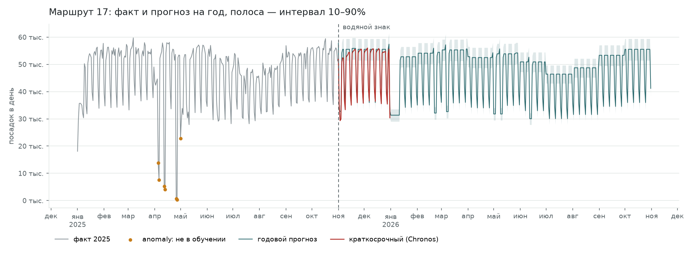
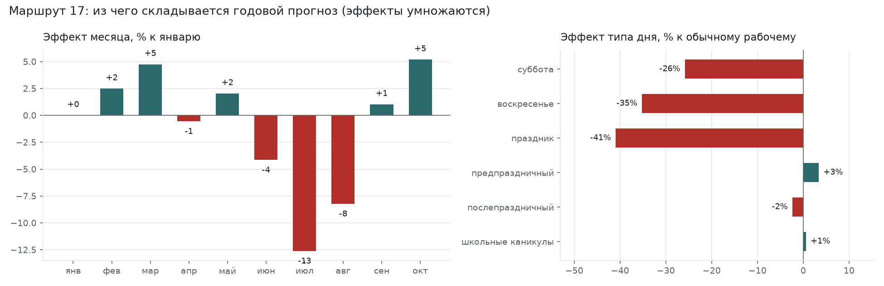
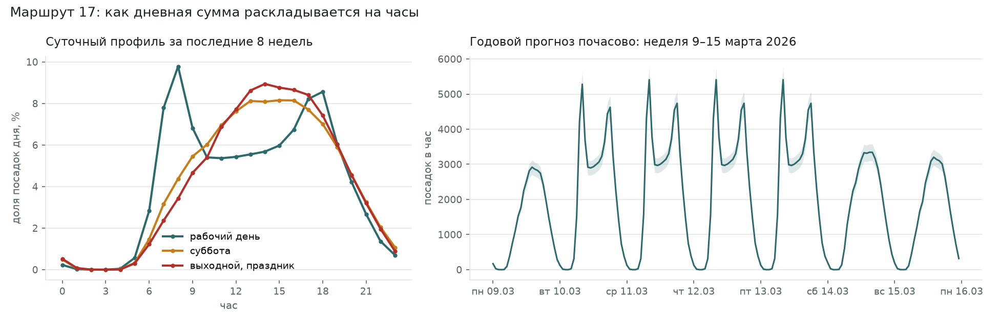

# Годовой прогноз: как устроен

Код: `ml/src/mtml/worker/year.py`. Запуск: `python -m mtml.worker once --kind year` (или без `--kind` — вместе с краткосрочным).
Графики: `uv run python ml/scripts/plot_year_forecast.py --route 17` → `docs/img/`.

## Зачем отдельный метод

Chronos проверен только на горизонте 61 день, а истории всего 10 месяцев, так что проверить его на год нечем. Поэтому год строится простой и объяснимой сезонной моделью. Бэкенд склеивает:

```
факт (до водяного знака) → краткосрочный Chronos (61 день) → годовой (до 365 дней)
```

## Метод за 7 шагов

1. **Обучающие дни.** Дневные суммы посадок маршрута с 1 января по водяной знак, только дни `final` без флага `anomaly`: ремонты и пропуски не описывают обычный режим маршрута.
2. **Модель маршрута** (отдельно для каждого):
   ```
   log(1 + дневная сумма) = уровень + эффект месяца + эффект типа дня + эффект каникул
   ```
   Обычный МНК. Логарифм делает эффекты процентными и умножающимися: «суббота в июле» = 0.74 × 0.87 от будня января. Прогноз никогда не бывает отрицательным.
3. **Тип дня** берётся из производственного календаря 2025–2026: рабочий, суббота, воскресенье, праздник, предпраздничный, послепраздничный. Переносы учитываются: 9 марта 2026 года в прогнозе выходной.
4. **Уровень** подтягивается к последним 8 неделям: средний остаток модели за них прибавляется к уровню. Тренд год к году по одному году не оценить.
5. **Месяцы без истории** (ноябрь и декабрь при данных до октября) берут эффект последнего наблюдённого месяца. Этот отрезок всё равно закрывает краткосрочный прогноз.
6. **Часы.** Дневная сумма × суточный профиль маршрута за последние 8 недель, отдельно для рабочего дня, субботы и выходного или праздника.
7. **Интервал q10–q90** — квантили ошибок модели на истории, перенесённые на прогноз (у маршрута 17 это ±7%).

Выход почасовой, в том же формате, что и краткосрочный прогноз: 10 маршрутов × 8 760 часов = 87 600 строк. Маршруты без истории (маршрут 5) получают 0 и попадают в `cold_start_routes`. Прогон занимает 1.6 секунды.

## Пример: маршрут 17



- Серая линия — факт 2025 года. Оранжевые точки — дни `anomaly` (апрельские провалы), в обучение они не шли.
- Красная линия — краткосрочный Chronos на ноябрь–декабрь. Бирюзовая — годовой прогноз с интервалом.
- Годовой прогноз ступенчатый: внутри месяца меняется только тип дня. Летний провал (июль–август) и праздники (1–9 января, 23 февраля, 9 марта, майские, 12 июня) видны.
- На ноябре–декабре годовой и краткосрочный прогнозы согласованы: score 0.91, месячные суммы различаются на 1–3%. Стык 1 января без скачка.



| часть модели | маршрут 17 |
|---|---|
| рабочий день января | 52 867 посадок |
| месяцы к январю | июль **−13%**, август −8%, июнь −4%, март и октябрь +5% |
| тип дня к рабочему | суббота **−26%**, воскресенье **−35%**, праздник **−41%**, предпраздничный +3% |
| школьные каникулы | +1%: летний провал уже объяснён месяцами |
| сдвиг уровня за последние 8 недель | −0.1% |



Суточный профиль рабочего дня — два пика: 8:00 (9.8% дня) и 18:00 (8.6%). У субботы и выходного — один пологий дневной максимум. Справа — неделя 9–15 марта 2026: понедельник 9 марта (перенесённый выходной) получает профиль выходного.

## Точность на истории

| окно | почасовой score | по дням | смещение |
|---|---|---|---|
| апрель → май–июнь | 0.853 | 0.886 | +3% |
| июнь → июль–октябрь (4 мес.) | 0.838 | 0.871 | +4% |
| август → сентябрь–октябрь | 0.787 | 0.824 | **−15%** |
| апрель → май–октябрь (6 мес.) | 0.810 | 0.844 | **+12%** |

Для сравнения: краткосрочный Chronos на 61 дне даёт 0.88.

**Слабое место** — сезонный переход в месяц, которого нет в истории. Модель берёт эффект последнего месяца: после лета она занижает осень, после весны завышает лето. В первый год работы системы это касается каждого нового месяца. На горизонте январь–октябрь 2026 все месяцы в истории 2025 года есть.

## Ограничения

1. Нет тренда год к году, только сдвиг уровня по последним 8 неделям.
2. Каникулы 2026/27 учебного года не внесены: на осени 2026-го их эффект не учитывается.
3. Ремонты исключены из обучения. Прогноз рисует обычный режим: правильно, если ремонт закончится, и неправильно, если он затянется.
4. Суточный профиль один на весь год (за последние 8 недель), без сезонных изменений часа пик.
5. Эффектов для поправочных слайдеров у годового прогона нет, они есть только у краткосрочного.

## Что можно улучшить

- Когда накопится больше года истории, сравнивать с тем же месяцем прошлого года: переходы между сезонами станут точнее.
- Сезонный профиль часов (лето и остальной год).
- Сглаживание ступенек на границах месяцев: интерполяция эффекта месяца по дням.
